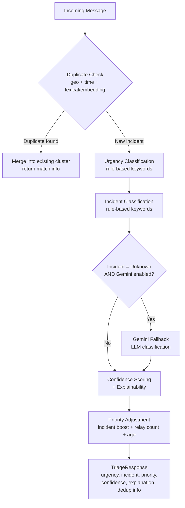

# SETU AI Service — Architecture

## 1. Overview

The AI/ML service is the triage layer of SETU. It takes a raw distress
message relayed through the mesh network and turns it into a
structured, prioritized, de-duplicated, explainable decision: what kind
of emergency this is, how urgent it is, whether it is a duplicate of an
incident already being tracked, and why the system decided all of that.

It is designed hybrid-first, not LLM-first: a fast, deterministic,
fully-offline rule engine handles the overwhelming majority of
messages, and a cloud LLM (Gemini) is only consulted as a narrow,
feature-flagged fallback for messages the rule engine genuinely cannot
classify. This matches the project's core constraint - the mesh exists
specifically for the moment connectivity is unreliable, so the triage
layer cannot depend on an API call being available.

## 2. Pipeline Flow

## 3. Module Responsibilities

| Module | Responsibility |
|---|---|
| `models/baseline_rules.py` | Rule-based urgency classifier (1-5), keyword engine, English + Hinglish |
| `models/incident_classifier.py` | Rule-based incident-type classifier (Fire, Medical, Accident, Flood, Building Collapse, Earthquake, Women Safety, Unknown) |
| `models/confidence_scorer.py` | Scores how confident the rule engine is in its own decision, based on match count and cross-category ambiguity |
| `models/explainability.py` | Turns confidence_scorer's raw output into a human-readable explanation sentence |
| `models/duplicate_detector.py` | Combines geo-distance (haversine), time window, and text similarity (lexical or multilingual embedding) to cluster repeated reports of the same incident |
| `models/embedding_similarity.py` | Lazy-loaded multilingual sentence-embedding model (soft dependency - falls back to lexical matching if unavailable) |
| `models/priority_adjuster.py` | Combines urgency, incident-type boost, relay count, and message age into a final dispatch priority |
| `models/pipeline.py` | Orchestrator - calls every module above in order and assembles the final response |
| `models/response_models.py` | Pydantic schema for the `/analyze` API response |
| `api/routes.py` | `POST /analyze` (text) and `POST /analyze-voice` (audio file, transcribed then run through the same pipeline) - exposed to the Backend Lead |
| `service/ai_service.py` | Callable wrapper around the pipeline for direct import (non-HTTP use) |
| `service/gemini_service.py`, `service/classifier_service.py` | Gated Gemini fallback - only called when the rule engine returns Unknown AND the feature flag is on. `gemini_service.py` also parses Gemini's constrained-format response back into `incident`/`urgency` so the fallback actually changes the pipeline's decision, not just an attached note (see `parse_gemini_response()`) |
| `service/voice_service.py` | Transcribes+translates a voice message to English via Whisper (soft dependency), feeding the same text pipeline `/analyze` uses |
| `config.py` | Every tunable constant in one place (thresholds, radii, feature flags) |
| `data/synthetic_messages.csv` | Labeled evaluation dataset - core emergency/non-emergency cases plus deliberate hard-negative keyword-collision traps |
| `models/read_data.py` | Evaluation script - per-class precision/recall/F1 via scikit-learn, reported separately for core vs hard-negative sets |

## 4. Key Design Decisions

**Hybrid rule-based + LLM fallback, not LLM-first.** A keyword engine is fast, free, fully offline, and 100% predictable - critical on an emergency path where a network call might not even be possible. Gemini is only invoked when the rule engine returns `Unknown`, and only if explicitly flagged on. It is never on the default/critical path. **2026-08-03 fix:** the fallback's response is now parsed (see `service/gemini_service.py`'s `parse_gemini_response()`) and actually applied to `incident`/`urgency`/`priority` when Gemini successfully classifies something the rule engine couldn't - previously the response was only attached as an informational `gemini_note` string and never changed the dispatch-facing fields, so a correctly-identified fire from Gemini could still come back as `incident: "Unknown", priority: 1.0`. The `gemini_assisted` response field flags when this happened.

**Confidence score is a direct readout of the rules, not a second model's guess.** The score is computed from how many keywords matched and whether other categories also partially matched (ambiguity) - not a black-box number. This makes it trustworthy for a dispatcher to sanity-check under pressure.

**Duplicate detection combines three independent signals.** Text similarity alone would wrongly merge two unrelated "help fire" reports from different buildings. Adding a geo-distance check (500m radius, haversine) and a time window fixes that. Multilingual embeddings are layered on top of lexical matching (not instead of it) so a Hinglish and an English report of the same incident still merge, with automatic fallback to lexical-only if the embedding model isn't available.

**The system is honest about its own limitations, on purpose.** The evaluation dataset deliberately includes "hard negative" messages - keyword collisions with no real emergency behind them (e.g. "fire safety drill", "phone battery is critical"). These are reported separately, not hidden, because a pure keyword system genuinely cannot distinguish literal danger from metaphorical or past-tense mentions without real language understanding.

## 5. Evaluation Results (as of 2026-08-03)

| Metric | Score |
|---|---|
| Urgency accuracy (core set, 55 messages) | 100.0% |
| Incident-type accuracy (core set) | 100.0% |
| Women Safety recall | 100% |
| Hard-negative false-trigger rate (8 deliberate traps) | 87.5% (expected, documented limitation) |
| Avg confidence: correct vs incorrect predictions | see `python -m models.read_data` |

Previous run (2026-08-02) had one core-set miss: "asurakshit" (Hinglish
for "unsafe") was missing from the Women Safety keyword lists, so a
message using only that word fell through to Unknown/urgency-4 instead
of Women Safety/urgency-5. Fixed in both `incident_classifier.py` and
`baseline_rules.py` — re-run `python -m models.read_data` any time to
regenerate this table from scratch.

## 6. Known Limitations

- **Keyword-collision false positives.** ~87.5% false-trigger rate on the dataset's deliberate hard-negative set. This is a structural limitation of keyword matching, not a bug - closing it needs real language understanding (the Gemini fallback path is the intended long-term answer, not more keywords).
- **In-memory duplicate cache.** `duplicate_detector.py`'s cluster list resets on restart and is not shared across multiple worker processes. Fine for a single-process demo/MVP; needs a shared store (Redis or the backend DB) before real multi-worker deployment.
- **Embedding similarity threshold is lightly tuned.** `EMBEDDING_SIMILARITY_THRESHOLD` in `config.py` was set from a handful of real samples, not a proper labeled validation set. Works, but should be retuned as more real Hinglish paraphrase pairs become available.
- **Multilingual coverage is Hinglish (Roman-script) only.** No Devanagari script support yet, and no Indian languages beyond Hindi. This applies to voice too - `service/voice_service.py` uses Whisper's translate task specifically so spoken Hindi comes back as English text the keyword lists can match, at the cost of losing some Hinglish-specific phrasing nuance in translation.
- **Voice transcription needs ffmpeg on the host + the Whisper model download on first run.** Both are soft dependencies (see `service/voice_service.py`) - `/analyze-voice` returns a clear 422 error if the model isn't available, rather than crashing the service.

## 7. Roadmap

- Devanagari script and additional Indian language coverage (including voice)
- Larger, real-world-sourced training/evaluation dataset
- Small pretrained multilingual classifier for faster fully-offline inference (reduces dependence on the keyword engine's exact-match limitations)

## 8. Tech Stack

| Layer | Technology |
|---|---|
| API | FastAPI + Pydantic |
| Rule engine | Pure Python, regex-based keyword matching |
| Multilingual similarity | sentence-transformers (`paraphrase-multilingual-MiniLM-L12-v2`) |
| LLM fallback | Gemini (feature-flagged, gated) |
| Evaluation | pandas + scikit-learn (`classification_report`) |
| Testing | pytest |
